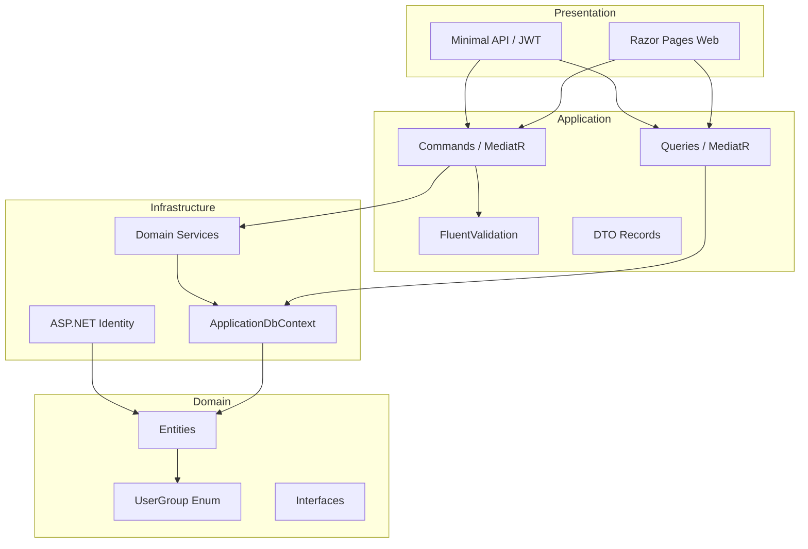

# AspBaseProj — Project Summary & Implementation Plan

> **Technology:** .NET 10 Fullstack (ASP.NET Core, PostgreSQL 17, EF Core, Npgsql)
> **Created:** 2026-06-17

---

## Project Overview

AspBaseProj is a **multi-user blog platform** built with ASP.NET Core on .NET 10. It provides role-based access control, a rich-text HTML editor for authors, nested comments with a guest moderation workflow, in-database image storage, social media link cards, responsive design, and a Web API mirroring UI functionality with JWT security.

---

## Core Features

| Feature Area | Description |
|---|---|
| **User Roles** | Author, Admin, Viewer + root superuser (IsRoot=true, bypasses all checks) |
| **Blog Posts** | CRUD with HTML rich-text editor, image embedding (stored as bytea in DB), social/video link cards, slug-based URLs, excerpts, view counts |
| **Comments** | Nested/threaded (self-referencing ParentCommentId), authenticated users auto-approved, guests require moderation |
| **Moderation** | Admin/root queue with individual & bulk approve/reject |
| **Admin Panel** | Dashboard with stats, user management (root-only), content management, system settings |
| **Web API** | RESTful endpoints mirroring Author/Viewer UI functionality, JWT bearer auth, Swagger/OpenAPI |
| **Responsive UI** | Bootstrap/Tailwind, desktop/tablet/mobile, hamburger menu on mobile |

---

## Architecture (Clean Architecture)

```
AspBaseProj.sln
├── src/
│   ├── AspBaseProj.Domain/          # Entities, enums, interfaces (no dependencies)
│   ├── AspBaseProj.Application/      # CQRS (Commands/Queries), DTOs, validators, interfaces
│   ├── AspBaseProj.Infrastructure/   # EF Core, Npgsql, Identity, repositories, services
│   └── AspBaseProj.Presentation/     # Razor Pages (web) + Minimal API (api) + Program.cs
└── tests/
    └── AspBaseProj.Tests/            # Unit + integration tests (Testcontainers)
```

**Dependency direction:** Presentation → Application → Domain; Infrastructure → Application → Domain

---

## Database Entities

| Entity | Key | Purpose |
|---|---|---|
| `AppUser` | `Guid` | Registered user with Group enum (Author/Admin/Viewer), IsRoot flag, avatar |
| `Post` | `Guid` | Blog post with HTML content, slug, author FK, publish state, view count |
| `Comment` | `Guid` | Nested comment (self-ref ParentCommentId), guest moderation, approval workflow |
| `Media` | `Guid` | Binary image storage (bytea), content-type, uploader FK, optional post FK |
| `SystemSetting` | `int` | Key-value config store (BlogTitle, ModerationEnabled, etc.) |
| `SocialLink` | `Guid` | Social/video platform link card embedded in a post |

---

## Key Technical Decisions

- **CQRS** via MediatR — separate Commands (write) and Queries (read, AsNoTracking, DTO projection)
- **FluentValidation** — centralized validation pipeline behavior
- **Dual Auth** — Cookie for Razor Pages web, JWT Bearer for Web API
- **Policy-based Authorization** — reusable policies checking UserGroup + IsRoot
- **HTML Sanitization** — prevent XSS in post bodies and comments
- **Schema-First** — `.roo/rules/database-schema.md` is the single source of truth
- **API Versioning** — Asp.Versioning from day one
- **PostgreSQL 17** — Docker container, named volume `postgres_abp_data`, network host

---

## Docker Configuration

```bash
sudo docker run --name aspbaseporj_db \
  -e POSTGRES_USER=admin \
  -e POSTGRES_PASSWORD=gandalf123! \
  -e POSTGRES_DB=deine_datenbank \
  --network host \
  -v postgres_abp_data:/var/lib/postgresql/data \
  --restart unless-stopped \
  -d postgres:17
```

---

## Implementation Phases

### Phase 1: Solution & Project Scaffolding
- Create solution with 4 projects (Domain, Application, Infrastructure, Presentation)
- Add project references (dependency direction inward)
- Add NuGet packages (EF Core, Npgsql, MediatR, FluentValidation, Identity, OpenAPI, Asp.Versioning, etc.)
- Create `appsettings.json` with connection string
- Configure `Program.cs` skeleton with middleware pipeline order

### Phase 2: Domain Layer
- Create entity classes: AppUser, Post, Comment, Media, SystemSetting, SocialLink
- Create UserGroup enum (Author, Admin, Viewer)
- Create domain interfaces (IRepository patterns as needed)

### Phase 3: Infrastructure — Database & EF Core
- Create ApplicationDbContext with DbSet configurations
- Implement IEntityTypeConfiguration<T> for all entities (Fluent API)
- Configure indexes (unique username, email, slug; composite comment index; etc.)
- Create initial EF Core migration with seed data (root user, default SystemSettings)
- Configure Npgsql provider and connection pooling

### Phase 4: Authentication & Authorization
- ASP.NET Core Identity with custom AppUser, UserGroup enum
- Registration (default Viewer group), Login, Logout
- Cookie auth for web, JWT bearer for API
- Authorization policies: AuthorPolicy, AdminPolicy, RootPolicy, AuthorOrAdminPolicy
- Password hashing, email confirmation support

### Phase 5: Application Layer (CQRS)
- MediatR setup with pipeline behaviors (validation, logging)
- Commands: CreatePost, UpdatePost, DeletePost, AddComment, ApproveComment, RejectComment, UploadMedia, UpdateSettings, ChangeUserGroup, etc.
- Queries: GetPostList, GetPostBySlug, GetCommentsByPost, GetPendingComments, GetUsers, GetSettings, etc.
- DTOs as record types
- FluentValidation validators for all commands

### Phase 6: Web UI — Razor Pages
- Layout with BlogHeader (blog title, search, user menu, admin link), responsive
- Home/Post List: PostCard list, pagination, search bar
- Post Detail: rendered HTML, embedded images, social link cards, comment section with nested replies
- Post Editor: title+slug, HTML editor (WYSIWYG), image uploader, social link editor, excerpt, publish toggle
- Login/Register pages
- User Profile: info, edit form, avatar upload, my posts list
- Admin Dashboard: stats overview, pending comments widget, nav cards
- Moderation Queue: pending comments table, bulk actions, individual approve/reject
- User Management (root-only): users table, group selector, activate/deactivate
- Content Management: all posts table, all comments table, edit/delete actions
- System Settings (root-only): settings form, save button
- Confirmation dialogs for all destructive actions

### Phase 7: Web API
- JWT token generation endpoint
- API controllers/Minimal API endpoints mirroring Author/Viewer UI
- Post CRUD (Author), Post read (Viewer), Comment CRUD, Media upload
- Asp.Versioning configuration
- Swagger/OpenAPI with auth token input
- CORS configuration (API paths only)

### Phase 8: Cross-Cutting Concerns
- HTML sanitizer (Ganss.XSS or HtmlSanitizer)
- Slug generation and uniqueness enforcement
- Response compression (Brotli/GZip), response caching
- Rate limiting
- CSP headers for web output
- Structured logging (ILogger)
- Global exception handling (Problem Details RFC 7807)

---

## Mermaid — Architecture Overview


