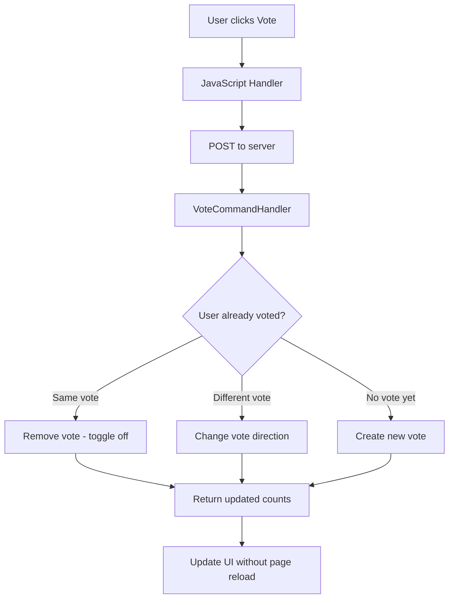
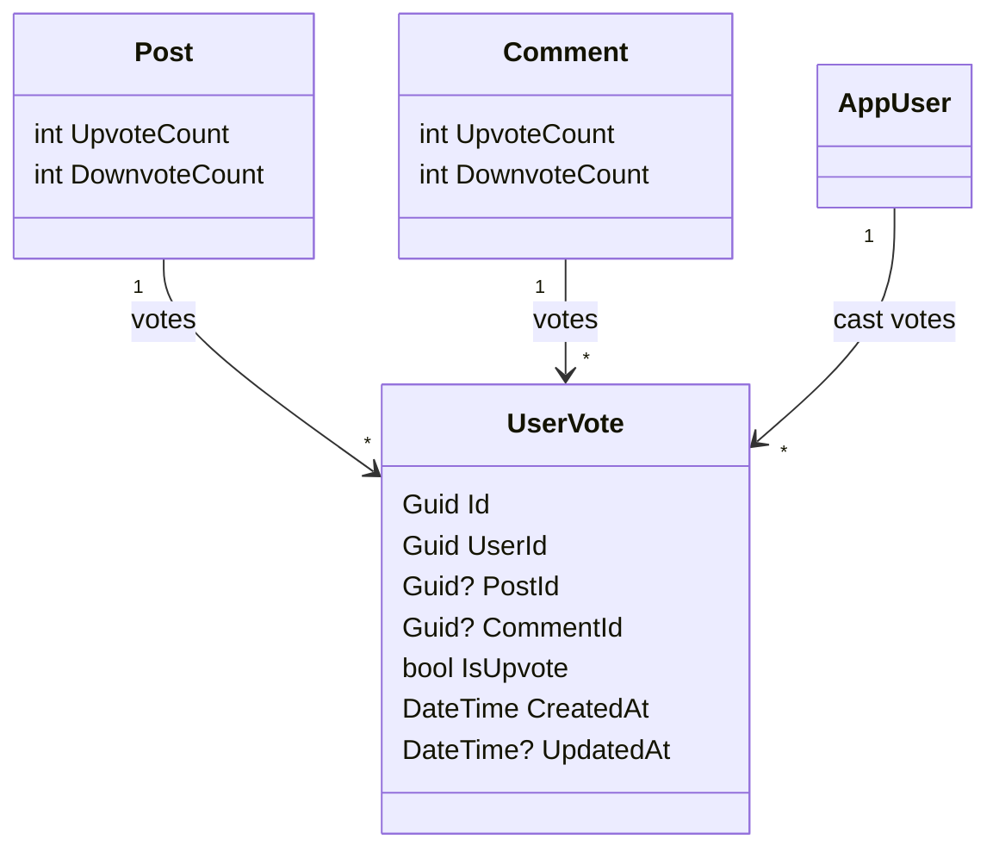

# Voting Feature Implementation Plan (Upvote/Downvote)

## Overview
Add a voting system for posts and comments where authenticated users can give one upvote or downvote per item.

## Requirements
- Only authenticated users can vote
- One vote per user per item (post or comment)
- User chooses upvote OR downvote (not both)
- System shows the user their current vote
- User can change vote (e.g., downvote -> upvote)

---

## Implementation Steps

### Step 1: Database Schema
**New Entity: `UserVote`**
- `Id` (Guid) — PK
- `UserId` (Guid) — FK to AppUser
- `PostId` (Guid, nullable) — FK to Post (if voting on a post)
- `CommentId` (Guid, nullable) — FK to Comment (if voting on a comment)
- `IsUpvote` (bool) — true = upvote, false = downvote
- `CreatedAt` (DateTime) — when voted
- `UpdatedAt` (DateTime?) — last changed

**Constraints:**
- Exactly one of PostId or CommentId must be set (not both, not null)
- Unique index on (UserId, PostId) where PostId is not null
- Unique index on (UserId, CommentId) where CommentId is not null
- Composite check: PostId XOR CommentId

**Post entity changes:**
- Add `UpvoteCount` (int) — total upvotes
- Add `DownvoteCount` (int) — total downvotes

**Comment entity changes:**
- Add `UpvoteCount` (int) — total upvotes
- Add `DownvoteCount` (int) — total downvotes

### Step 2: Update Domain Entities
- Add UserVote entity
- Add navigation properties to AppUser (UserVotes)
- Add vote counts to Post and Comment

### Step 3: EF Core Configuration
- Create UserVoteConfiguration
- Update PostConfiguration, CommentConfiguration with new fields
- Create migration

### Step 4: Application Layer (CQRS)
**Commands:**
- `VoteOnPostCommand` — PostId, UserId, IsUpvote
- `VoteOnCommentCommand` — CommentId, UserId, IsUpvote

**Queries:**
- `GetUserVotesForPostQuery` — Get current user's vote on a post
- `GetUserVotesForCommentsQuery` — Get current user's votes on comments for a post

**DTOs:**
- `VoteDto` — Id, IsUpvote, ItemType (Post/Comment), ItemId

### Step 5: Web UI
**Detail.cshtml:**
- Add upvote/downvote buttons to post (below post content, before comments)
- Show current vote counts
- Highlight active vote button

**_CommentTree.cshtml:**
- Add upvote/downvote buttons to each comment
- Show current vote counts
- Highlight active vote button

**JavaScript:**
- Click handler for vote buttons
- Toggle logic (upvote -> downvote -> no vote)
- Visual feedback (highlight active, show counts)

### Step 6: API Endpoints
- POST /api/v1/posts/{postId}/vote
- POST /api/v1/comments/{commentId}/vote

### Step 7: Database Migration
- Update .roo/rules/database-schema.md
- Create EF Core migration

---

## Mermaid — Data Flow

## Mermaid — Class Diagram

---

## Files to Modify/Create

| File | Action |
|------|--------|
| `.roo/rules/database-schema.md` | Update - add UserVote entity |
| `src/AspBaseProj.Domain/Entities/UserVote.cs` | Create - new entity |
| `src/AspBaseProj.Domain/Entities/Post.cs` | Update - add vote counts |
| `src/AspBaseProj.Domain/Entities/Comment.cs` | Update - add vote counts |
| `src/AspBaseProj.Infrastructure/Configurations/UserVoteConfiguration.cs` | Create - EF config |
| `src/AspBaseProj.Infrastructure/Configurations/PostConfiguration.cs` | Update - vote counts |
| `src/AspBaseProj.Infrastructure/Configurations/CommentConfiguration.cs` | Update - vote counts |
| `src/AspBaseProj.Application/DTOs/PostDto.cs` | Update - add vote fields |
| `src/AspBaseProj.Application/DTOs/CommentDto.cs` | Update - add vote fields |
| `src/AspBaseProj.Application/DTOs/VoteDto.cs` | Create - vote DTO |
| `src/AspBaseProj.Application/Interfaces/IApplicationDbContext.cs` | Update - add DbSet |
| `src/AspBaseProj.Infrastructure/Data/ApplicationDbContext.cs` | Update - add DbSet |
| `src/AspBaseProj.Application/Features/Votes/Commands/CreateVoteCommand.cs` | Create |
| `src/AspBaseProj.Application/Features/Votes/Commands/CreateVoteCommandHandler.cs` | Create |
| `src/AspBaseProj.Application/Features/Votes/Queries/VoteQueries.cs` | Create |
| `src/AspBaseProj.Presentation/Pages/Posts/Detail.cshtml` | Update - add vote UI |
| `src/AspBaseProj.Presentation/Pages/Posts/Detail.cshtml.cs` | Update - add vote handlers |
| `src/AspBaseProj.Presentation/Pages/Shared/_CommentTree.cshtml` | Update - add vote UI |
| `src/AspBaseProj.Presentation/Pages/Posts/Detail.cshtml` | Update JS scripts |